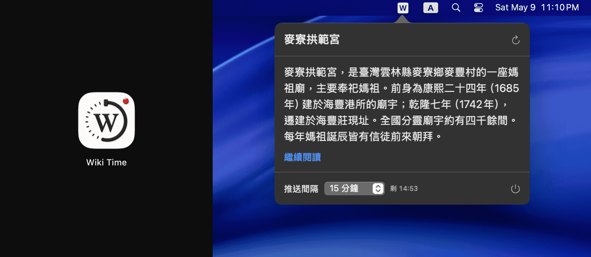

# Wiki Time

macOS menu bar 維基百科隨機條目推送工具，定時把繁體中文 Wikipedia 條目送到通知中心，適合用零碎時間讀一點新東西。



## 支援功能

- Menu bar 快速查看目前推送條目
- 從中文 Wikipedia 隨機取得繁體中文條目
- 支援系統通知推送
- 可開啟 Wikipedia 原文繼續閱讀
- 推送間隔可選 1 分鐘到 4 小時
- 支援自訂推送分鐘數
- 可暫停推送 1 小時或今天不再推送

## 開發環境

- macOS 15.5+
- Xcode 16+
- Swift 5

專案目前沒有額外第三方套件依賴，clone 下來就能開。

## 下載

從以下位置下載最新版本：

[https://github.com/zenkarsha/wiki-time/releases](https://github.com/zenkarsha/wiki-time/releases)

安裝 App 後，macOS 可能會在第一次啟動時阻擋它。如果發生這種情況，請前往 `系統設定 > 隱私權與安全性`，然後點擊 `強制打開`。

## 執行方式

用 Xcode：

1. 開啟 `Wiki Time/Wiki Time.xcodeproj`
2. 選 `Wiki Time` scheme
3. 直接 Run

用指令列：

```bash
xcodebuild \
  -project "Wiki Time/Wiki Time.xcodeproj" \
  -scheme "Wiki Time" \
  -destination "platform=macOS" \
  build
```

## 測試

```bash
xcodebuild \
  test \
  -project "Wiki Time/Wiki Time.xcodeproj" \
  -scheme "Wiki Time" \
  -destination "platform=macOS" \
  -derivedDataPath ".deriveddata/test"
```

## 本機安裝

repo 內有一支安裝腳本，會：

- 用 `Release` 組態 build app
- 關閉正在執行的 `Wiki Time`
- 複製 `.app` 到 `/Applications`

指令：

```bash
./scripts/install_local.sh
```

## 專案結構

```text
.
├── README.md
├── screenshot.png
├── Wiki Time/
│   ├── Wiki Time.xcodeproj
│   ├── Wiki Time/
│   │   ├── Wiki_TimeApp.swift
│   │   ├── AppDelegate.swift
│   │   ├── ContentView.swift
│   │   ├── ArticleStore.swift
│   │   ├── WikipediaClient.swift
│   │   ├── WikiArticle.swift
│   │   ├── PushInterval.swift
│   │   ├── Wiki_Time.entitlements
│   │   └── Assets.xcassets/
│   ├── Wiki TimeTests/
│   └── Wiki TimeUITests/
├── Wiki Time-icon/
└── scripts/
```

## License

MIT License
